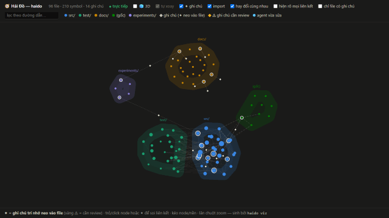

# 🧭 haido (Hải Đồ)

[](https://github.com/lebac-svg/haido/actions/workflows/ci.yml)
[](https://www.npmjs.com/package/haido)
[](LICENSE)

> **A captain's log for AI coding agents** — project memories anchored to code,
> aware of their own staleness.

AI coding agents forget. Context windows fill up, sessions end, and every hard-won
decision — *"amounts are integer cents, never floats"*, *"we tried library X, it broke Y"* —
evaporates. Convention files (`CLAUDE.md`, rules, memory banks) try to help, but they rot
silently: nobody knows which notes still match the code.

**haido** fixes the rot. Every note is **anchored** to a specific function or file with a
content fingerprint. When that code changes, the note **raises its hand** — it shows up in a
review queue with the old/new fingerprints, gets confirmed, moved, or retired. Notes are
injected into your agent's context **at the exact moment it touches the related file**, within
a token budget. No cloud, no embeddings, no LLM guessing — one SQLite file and honest hashes.

*Hải Đồ* is Vietnamese for a nautical chart; the log that keeps a ship's knowledge honest.

## What it feels like

```text
$ (agent edits src/board.ts)
⚠ haido: note [m_x1] anchored at `src/board.ts#Board.move` just went DRIFT
  because of this change — if it no longer holds, reanchor or update the note.

$ (agent reads src/pricing.ts — hook injects, unprompted)
### Related memories (haido)
- ⛔ INVARIANT [m_9k] `src/pricing.ts#computeTotal`
  Money is integer cents — never floats. why: float rounding corrupted invoices once
```

The agent never has to *remember to remember*. SessionStart injects a compressed project map
plus the standing laws; touching a file injects the notes anchored around it (once per
session); editing code that invalidates a note triggers an immediate warning.

## See it live

`haido viz --live` serves the map on 127.0.0.1 and streams every change into the open page:
new files bloom in, the file being edited glows and cools down, and a note flashes yellow
the very moment a save makes it drift.



*The bridge, recorded headlessly against this very repo: the 2D chart with its instruments —
3D globe, activity band, inspector (structure + notes of the selection) and the ship's log.
Cyan = the agent editing `src/viz/*`, a new file blooms in, then a human edit drifts note
`m_boot_010` (yellow flash, logged in the band) and heals when reverted.*

```bash
haido viz --live --open   # leave it on a second monitor while your agent works
```

## Install

Requires Node ≥ 20. A global install is recommended — the hooks invoke `haido` from your PATH.

### With Claude Code (hooks + MCP — the full experience)

```bash
npm install -g haido

cd /your/project
haido init                 # creates .haido/, indexes the code, mines git co-change
haido install claude-code  # writes hooks into .claude/settings.json + MCP into .mcp.json
# restart your Claude Code session — it now has a memory
```

From then on, automatically: the project map is injected at session start (and re-briefed
after every context compaction), anchored notes appear the moment a file is touched, an
edit that invalidates a note warns on the spot, and a session that edited a lot without
recording anything gets one reflection nudge when it stops. Flags: `--global` writes hooks
to `~/.claude/settings.json` for all projects; `--command node /path/to/dist/cli.js`
overrides the launcher for source builds.

### With Claude Desktop (MCP only — recall on demand)

```bash
cd /your/project
haido install claude-desktop   # registers MCP server 'haido-<project>' pinned to this repo
# restart Claude Desktop
```

Desktop has no hooks, so nothing is injected automatically — you ask instead:
*"call `map_overview`"* · *"`recall` notes around src/pricing.ts"* · *"`remember` this
decision: …"* · *"anything in `stale_memories`?"*. Run the install once per project;
each project gets its own named server.

Housekeeping: add `.haido/` to `.gitignore` (init reminds you) — the database is
per-machine; knowledge travels with the repo via the memory pack.

From source instead of npm: `git clone https://github.com/lebac-svg/haido.git && cd haido && npm install && npm run build`,
then use `node /path/to/haido/dist/cli.js` in place of `haido` (and pass
`--command node /path/to/haido/dist/cli.js` to the installers).

## The pieces

| Surface | What you get |
|---|---|
| **Hooks** (Claude Code) | Auto-inject: project map at session start (re-briefed after compaction); anchored notes per touched file; drift warnings right after an edit invalidates a note; one stop-time reflection nudge when a busy session recorded nothing |
| **MCP tools** | `recall` · `remember` · `find_related` · `map_overview` · `stale_memories` · `reanchor` |
| **CLI** | `init · index [--watch] · serve · install · remember · recall · related · overview · stale · reanchor · export · import · viz [--live] · stats · doctor` |
| **`haido viz`** | A self-contained bridge console (one HTML file, zero deps): the 2D chart — files colored by directory, import/co-change links with spotlight-on-hover, memories as diamond satellites — surrounded by instruments: a rotating 3D globe, an inspector (per-symbol structure + anchored notes of the selection) and the ship's log (every note on a dated timeline) |
| **`haido viz --live`** | The same bridge as a living thing, served on 127.0.0.1: new files bloom in, the file being edited glows (cyan = your agent, white = a human), notes flash yellow the moment an edit makes them drift, and the activity band journals every event with a timestamp — watch your agent work in real time |
| **Memory pack** | `export/import --pack`: one markdown file per note, committed to git — knowledge travels with the repo and is reviewed in PRs; recorded fingerprints carry staleness across machines |

## How staleness works (the core trick)

1. `remember` snapshots a **normalized content hash** of the anchored symbol/file
   (comments and whitespace stripped — `prettier` runs never cry wolf).
2. Every index pass re-checks all anchors against the current code:
   - hash matches → **fresh** (a revert heals a stale note automatically)
   - hash differs → **drift**, with old/new fingerprints for review
   - target vanished but an identical twin exists → **moved**: the anchor follows
     renames/moves silently
   - target gone for good → **missing**, with candidate suggestions
3. A note with any drifted/missing anchor enters the review queue: `confirm`
   (still true — snapshot the new hash), `move`, or `retire`. Nothing rots silently.

Hygiene is enforced at write time: every note needs a **why** and **≥ 1 anchor**, one fact
per note (≤ 700 chars), duplicates are flagged. Notes record *decisions, invariants,
gotchas, conventions* — never things derivable from code.

## Command reference

| Command | What it does |
|---|---|
| `haido init` | Create `.haido/`, index the repo, mine git co-change, write a starter `haido.toml` |
| `haido index [--watch]` | Re-index changed files + reconcile anchors; `--watch` re-runs on every save |
| `haido install claude-code [--global] [--command …]` | Wire hooks + MCP into Claude Code (idempotent, backs up what it touches) |
| `haido install claude-desktop` | Register the per-project MCP server for Claude Desktop |
| `haido viz [--out <file>] [--open]` | Write the self-contained map HTML (default `.haido/map.html`) |
| `haido viz --live [--port <n>] [--open]` | Serve the map on 127.0.0.1 (default port 6160) and stream repo changes into it live |
| `haido remember --type <t> --title <…> --body <…> --why <…> --anchor <sym:qname\|file:path>` | Record a note; types: `decision · invariant · gotcha · convention · todo` |
| `haido recall [query] [--file <path>] [--symbol <qname>] [--budget <tokens>]` | Ranked notes for a file / symbol / free-text query |
| `haido related <file-or-qname> [--limit <n>]` | Files most related to a target (imports, co-change, same dir) |
| `haido overview [--budget <tokens>]` | Project map + standing laws — what a fresh session should read first |
| `haido stale` | Review queue: notes whose anchored code changed, with old→new token diffs |
| `haido reanchor <id> --confirm` \| `--retire` \| `--move <anchorId> --to <target>` | Resolve a stale note: still true / no longer true / code relocated |
| `haido export --pack <dir>` · `haido import --pack <dir>` | Memory pack: one reviewable `.md` per note, travels through git |
| `haido export --viz <file>` | Raw map+memory JSON snapshot (stable format) |
| `haido stats` | Dogfood metrics: memories by type/freshness, anchors, notes injected per session |
| `haido serve [--root <path>]` | Run the MCP stdio server by hand (the installers wire this up for you) |
| `haido doctor` | Diagnose the workspace: node, git, db, config |

Every command answers `--help` with its flags.

## Configuration (`haido.toml`, committed with your repo)

```toml
[index]
exclude = ["generated/**"]   # on top of built-in skips (node_modules, dist, …)
[cochange]
min_together = 3             # files must co-change ≥ N commits to become an edge
[recall]
budget_tokens = 800          # hook injection budget per file
[ui]
lang = "en"                  # output language: "en" (default) | "vi"
```

TypeScript/TSX/JS + Python are symbol-indexed; markdown/JSON/YAML/TOML are file-level
anchor targets (yes, you can anchor decisions to your specs). 100% local: no network
calls, no telemetry.

## Design docs

English overview: [docs/DESIGN.md](docs/DESIGN.md) · Engineering constitution:
[docs/QUALITY.md](docs/QUALITY.md) · Full design docs (Vietnamese originals — this
project is built by a Vietnamese-speaking team, and haido's own memory pack in
[docs/memory/](docs/memory/) is part of the dogfood): [docs/vi/](docs/vi/)

## Status

Published on npm (`npm install -g haido`). The core loop is verified live in real
Claude Code sessions (hooks canary + MCP roundtrips), self-hosted on this repo — the
memory pack in `docs/memory/` and the README GIF are both products of that dogfood.
Roadmap: doc↔code "spec-of" edges, semantic zoom for the map, `.mcpb` bundle for
Claude Desktop.

## License

MIT
